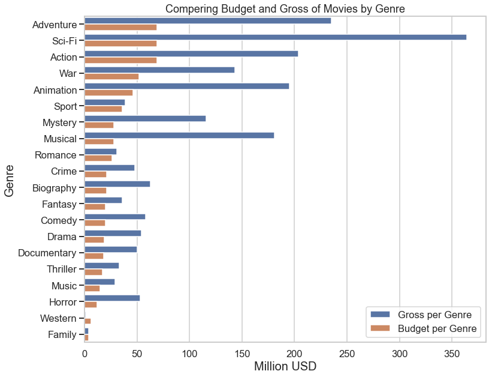

# Data Analysis on Movie Profitability

**Authors:** Maryam Ghaffari
***

## Overview

Entertainment industry have been characterized by growth over the recent years. No doubt investment in this industry would be a smart strategy for big corporations to achieve their market share. However it is a high risk industry and it is affected by many complex factors, like movie quality, genre, leading actors, director, screenwriter, movie title, movie type, screen time, language, movie rating, release time, advertisement, production company, and distribution company. Microsoft have decided to create a new movie studio and they asked exploratory data analysis to help them to know what types of movies are most profitable

## Business Understanding

 Microsoft have decided to create a new movie studio, but they don’t know anything about creating movies. To run a new business, it is important to have an exploratory data analysis to understand the marketplace, set revenue and profitability goals. Exploring available database would help them to know what types of films are currently doing the best at the box office. In addition, considering other criteria like realse time and running time trend enhances the likelihood of a descent return on their investment. 
 The key business questions include:
 
    - Qestion 1; Which Generes need more budget and create gross more?
    
    - Qestion 2: Best relase month for geners and gross?
    
    - Qestion 3 : What is the perfect running time for a movie?

## Data Understanding and Analysis

The general research strategy in this project is to do exploratory data analysis on the persent data collection in film industry. The process include belwo steps:

 - Import libraries and load dataset
 
 - Data cleaning
 
 - Asking Analytical Questions and Visualizations
 
 - Conclusion & Recommendations
 
 
### Import libraries and load dataset

The first step to start a project is to choose neaded libraries and modulas in python and import them to your framework. For this project belwo libries were used:

- `Pandas`: a software library written for the Python programming language used for data analysis and associated manipulation of tabular data in Dataframes

- `Numpy`:  the core library for scientific computing in Python

- `Matplotlib`: a comprehensive library for creating static, animated, and interactive visualizations in Python

- `Seaborn`: a Python visualization library based on matplotlib. It provides a high-level interface for drawing attractive statistical graphics. 

- `OS`: a module in Python provides functions for creating and removing a directory (folder), fetching its contents, changing and identifying the current directory.

- `Warnings` :  a module suppresses repeated warnings from the same source to cut down on the annoyance of seeing the same message over and over.

There are 6 movie database in this project: 

1. bom.movie_gross.csv.gz

2. tn.movie_budgets.csv.gz

3. tmdb.movies.csv.gz

4. rt.movie_info.tsv.gz

5. rt.reviews.tsv.gz

6. im.db

These data collected from various locations, the different files have different formats. Some are compressed CSV (comma-separated values) can be opened using  `pd.read_csv()` method, while the data from IMDB is located in a SQLite database and can asscess them with `pd.read_sql()` method. 

## Data cleaning
The second step in doing a project is to cleaning up datasets and making them operational. In fact, this step in acquiring and cleaning data is 80% of the work. In this way, dealing with messy data means dealing with missing values, inconsistent formatting, malformed records, or nonsensical outliers. The begining of data cleaning is to print a concise summary of a DataFrame with `.info()` method and view a small sample of DataFrame object with `.head()` method. Through the `.info()` method we access the valuable information about missing values and datatype. `.isnull()` is a method that help us to determin the missing value and based on the percentage of them or necessity of them, decided on delet (`.dropna()` method) them or fill (`.fillna()` method) them with sutiable values. With duplicated() method we also the duplication and drop them through `.drop_duplicates()` method. 

Data in wrong format can make it difficult, or even impossible, to analyze data. `.to_datetime()` and `.astype()` were two methods we used to change the data type. In some cells we had wrong data and changed them with `.replace()` method. 
 
Sometimes we need to updates the content of several DataFrame by merging them together (`.merge()` method. Selecting type of merge and the common coulnm to merge on it change the new datafram structure.  

## Asking Analytical Questions and Visualizations

Asking the right data analysis questions is crucial for getting accurate, actionable insights from the data analytics. In this project we answer to three main questions.
### Question 1; Which Genres need more budget and create gross more?

To answer to this question, movies were categorized based on their genres. Then their production budget and worldwide gross plot based on genres. 

